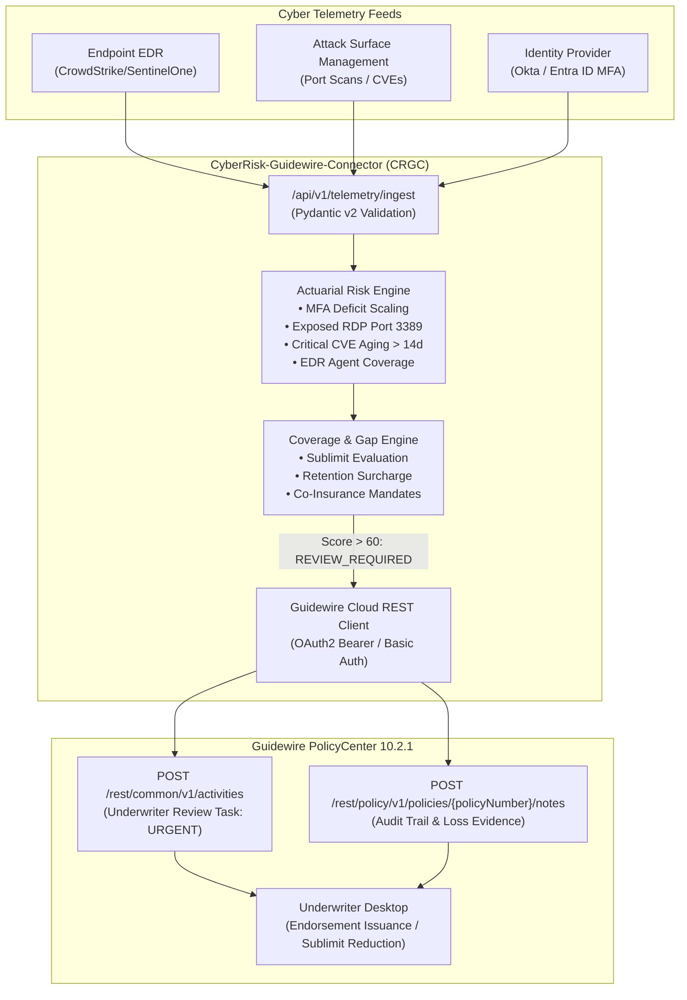

# CyberRisk-Guidewire-Connector (CRGC)

[](https://www.python.org/)
[](https://fastapi.tiangolo.com)
[](https://docs.pydantic.dev/)
[](https://www.guidewire.com/)
[-brightgreen.svg)]()

> **Enterprise Continuous Cyber Risk Advisory Service & Actuarial Coverage Gap Engine interfacing directly with Guidewire PolicyCenter 10.2.1 Cloud REST APIs.**

---

## 1. Executive Summary & Domain Architecture

In commercial cyber liability insurance, traditional point-in-time underwriting during annual policy inception leaves carriers blind to acute intra-policy cybersecurity deterioration. Catastrophic ransomware claims typically stem from observable security control failures (e.g., exposed RDP ports, disabled MFA during account migrations, or unpatched remote code execution vulnerabilities).

**CyberRisk-Guidewire-Connector (CRGC)** operates as a cloud-native advisory edge service that bridges external cybersecurity posture telemetry with **Guidewire PolicyCenter 10.2.1**.

### Core Architecture Capabilities
- **Continuous Telemetry Ingestion**: Ingests attack surface management (ASM), identity governance, and endpoint detection and response (EDR) posture telemetry.
- **Explainable Actuarial Risk Engine**: **Zero opaque "black-box" machine learning**. Employs transparent, mathematically auditable actuarial factor penalties aligned with state Department of Insurance (DOI) underwriting standards.
- **Coverage Engine**: Automatically evaluates in-force policy limits, sublimits, deductibles, and co-insurance against empirical risk scores.
- **Guidewire Cloud REST Integration**: When risk scores breach critical underwriting thresholds (`> 60.0`), CRGC dispatches **Underwriter Review Activities** and appends **Policy Notes** directly into Guidewire PolicyCenter 10.2.1.



---

## 2. Guidewire PolicyCenter 10.2.1 Cloud REST API Specifications

CRGC adheres strictly to Guidewire Cloud Platform (GWCP) REST standards for **PolicyCenter 10.2.1**:

### 1. Underwriter Review Activity
- **Endpoint**: `POST /rest/common/v1/activities`
- **Headers**:
  ```http
  GW-PolicyCenter-Version: 10.2.1
  Content-Type: application/json
  Authorization: Bearer <GWCP_OAUTH2_TOKEN>
  X-Correlation-Id: CRGC-<UUID>
  ```
- **Payload Structure**:
  ```json
  {
    "data": {
      "attributes": {
        "activityPattern": "general_reminder",
        "subject": "Cyber Risk Alert: Underwriter Review Required - ABC Technologies Inc. (POL-001)",
        "description": "Risk score 80.0/100 (CRITICAL). MFA enforcement dropped to 65.0%, RDP Port 3389 exposed, 2 critical CVEs unpatched > 14d. Recommended -50% Ransomware sublimit and 3x retention surcharge.",
        "priority": { "code": "urgent" },
        "mandatory": true,
        "targetDate": "2026-09-26T16:00:00Z",
        "status": { "code": "open" }
      },
      "relationships": {
        "policy": {
          "data": {
            "id": "POL-001",
            "type": "Policy"
          }
        }
      }
    }
  }
  ```

### 2. Policy Audit Note
- **Endpoint**: `POST /rest/policy/v1/policies/{policyNumber}/notes`
- **Payload Structure**:
  ```json
  {
    "data": {
      "attributes": {
        "subject": "Continuous Cyber Risk Assessment Audit - REVIEW_REQUIRED (ASM-4618B603)",
        "body": "=== CRGC CYBER RISK ASSESSMENT AUDIT LOG ===\nPolicy: POL-001\nAggregate Score: 80.0/100.0\nTier: CRITICAL\n...",
        "confidential": false,
        "topic": { "code": "underwriting" }
      }
    }
  }
  ```

### 3. Built-in Deterministic Simulation (`GW_MOCK_MODE=true`)
When running locally without a live PolicyCenter cluster, `GW_MOCK_MODE=true` intercepts outgoing calls and returns deterministic Guidewire Cloud REST response structures with synthetic public IDs (e.g. `pc:act_0d0a0c`, `pc:note_b4d6df`). To connect to live Guidewire Cloud instances, set `GW_MOCK_MODE=false` in `.env`.

---

## 3. Actuarial Risk Engine & Mathematical Formulations

To ensure full actuarial explainability and zero black-box opacity, the risk score is a deterministic linear function bounded between `0.0` (cleanest posture) and `100.0` (maximum risk):

$$\text{Aggregate Risk Score} = \min\left(100.0, \; \text{Base Score} + \sum \text{Penalties}\right)$$

### Actuarial Factor Calibrations

| Factor Name | Benchmark Threshold | Loss Correlation & Actuarial Rationale | Mathematical Penalty Formula | Max Penalty |
| :--- | :---: | :--- | :--- | :---: |
| **Base Inherent Risk** | N/A | Residual operational baseline exposure for active businesses | Fixed constant: `5.0` | `5.0 pts` |
| **MFA Enforcement Rate** | $\ge 80.0\%$ | Eliminates >90% of automated credential stuffing and account takeover | $1.0\text{ pt per }1\%\text{ deficit below }80\%$ | `30.0 pts` |
| **Public Remote Access (RDP)** | Closed / Filtered | Present in >50% of external ransomware initial compromises | $+25.0\text{ pts if Port 3389 reachable}$ | `25.0 pts` |
| **Critical CVE Aging** | Patch $\le 14\text{ days}$ | Weaponized RCE exploits proliferate heavily after 14 days | $+12.5\text{ pts per critical CVE aging }> 14\text{d}$ | `35.0 pts` |
| **EDR Agent Coverage** | $\ge 85.0\%$ | Endpoint visibility to prevent lateral movement and intrusion dwell | Scaled deficit: $\min(20.0, \, \text{deficit} \times 111.11)$ | `20.0 pts` |

### Underwriting Action & Coverage Thresholds

| Aggregate Risk Score | Risk Classification Tier | Underwriting Action | PolicyCenter Coverage & Endorsement Action |
| :---: | :---: | :---: | :--- |
| **$0.0 - 39.9$** | `LOW` | `NOMINAL` | **Standard Terms Maintained**: \$5M Aggregate Limit, \$2.5M Ransomware Sublimit, \$50k Retention. |
| **$40.0 - 60.0$** | `MEDIUM` | `MONITOR` | **Advisory Warning**: Dispatches automated advisory notice (`ADV-CYBER-HYGIENE-NOTICE`) to broker; initiates 30-day tracking window. |
| **$60.1 - 100.0$** | `HIGH` / `CRITICAL` | `REVIEW_REQUIRED` | **PolicyCenter Action Dispatched**: Mandatory Underwriter Activity Task created. <br>• **Sublimit Cut**: $-50\%$ reduction to ransomware sublimit (\$1.25M). <br>• **Retention Surcharge**: $2.0\times$ to $3.0\times$ deductible increase (\$150k). <br>• **Co-Insurance Mandate**: $20\%-25\%$ insured loss participation (Endorsement `CYBER-CRITICAL-SURCHARGE-RESTRICT-2026`). |

---

## 4. Deterministic Scenarios in `data/scenarios.json`

CRGC includes three deterministic scenarios evaluating the in-force policy for **ABC Technologies Inc.** (`POL-001`):

```json
{
  "company_name": "ABC Technologies Inc.",
  "policy_number": "POL-001",
  "in_force_terms": {
    "aggregate_limit": 5000000.0,
    "ransomware_sublimit": 2500000.0,
    "retention": 50000.0
  }
}
```

### Scenario Comparison Table

| Metric / Attribute | Scenario A: Healthy Baseline | Scenario B: Deteriorating Risk | Scenario C: Remediated Posture |
| :--- | :---: | :---: | :---: |
| **MFA Enforcement Rate** | $98\%$ ($\ge 80\%$) | $65\%$ ($15\%$ deficit) | $98\%$ ($\ge 80\%$) |
| **Exposed RDP (Port 3389)** | `False` | `True` (Port 3389 Open) | `False` |
| **Critical CVEs Aging >14d** | $0$ | $2$ (`CVE-2024-38077`, `CVE-2024-21413`) | $0$ |
| **EDR Endpoint Coverage** | $95\%$ ($\ge 85\%$) | $76\%$ ($9\%$ deficit) | $95\%$ ($\ge 85\%$) |
| **Computed Base Risk** | $5.0$ | $5.0$ | $5.0$ |
| **MFA Penalty** | $0.0$ | $+15.0$ | $0.0$ |
| **RDP Exposure Penalty** | $0.0$ | $+25.0$ | $0.0$ |
| **CVE Aging Penalty** | $0.0$ | $+25.0$ | $0.0$ |
| **EDR Deficit Penalty** | $0.0$ | $+10.0$ | $0.0$ |
| **Final Aggregate Risk Score**| **$5.0$ / 100.0** | **$80.0$ / 100.0** | **$5.0$ / 100.0** |
| **Assigned Risk Tier** | `LOW` | `CRITICAL` | `LOW` |
| **Policy Action** | `NOMINAL` | `REVIEW_REQUIRED` | `NOMINAL` |
| **PolicyCenter Activity** | None (Standby) | **Dispatched (Urgent)** | None (Standby) |
| **PolicyCenter Policy Note** | None | **Dispatched (Audit Trail)** | None |

---

## 5. Repository Directory & File Structure

```
cyber-risk-platform/
├── README.md                 # System documentation, actuarial models, and integration specs
├── pyproject.toml            # Project dependencies, build system, and pytest configuration
├── .env.example              # Sample environment configuration file
├── run_demo.py               # Interactive CLI demonstration runner
├── config/
│   ├── __init__.py
│   └── settings.py           # Pydantic v2 BaseSettings (API endpoints, credentials, thresholds)
├── app/
│   ├── __init__.py
│   ├── main.py               # Production FastAPI app factory, CORS, audit middleware, health check
│   ├── api/
│   │   ├── __init__.py
│   │   └── v1/
│   │       ├── __init__.py
│   │       ├── router.py     # Consolidated API v1 router
│   │       ├── telemetry.py  # Ingestion & retrieval endpoints for security posture snapshots
│   │       └── assessments.py# On-demand evaluation & Guidewire workflow triggers
│   ├── schemas/
│   │   ├── __init__.py
│   │   ├── telemetry.py      # Pydantic v2 telemetry models with field validation
│   │   ├── risk.py           # Actuarial risk scores, penalties, and coverage adjustments
│   │   └── guidewire.py      # Guidewire PolicyCenter 10.2.1 Cloud REST JSON schemas
│   ├── core/
│   │   ├── __init__.py
│   │   ├── risk_engine.py    # 100% explainable actuarial risk scoring engine
│   │   └── coverage_engine.py# Policy terms, sublimits, and retention surcharge evaluation
│   └── services/
│       ├── __init__.py
│       └── guidewire_client.py# Async HTTP client interfacing with PolicyCenter 10.2.1 REST endpoints
├── data/
│   └── scenarios.json        # Deterministic test scenarios (Healthy, Deteriorating, Remediated)
└── tests/
    ├── __init__.py
    ├── test_risk_engine.py   # Unit tests for scoring weights, thresholds, and scenarios
    ├── test_guidewire_client.py# Mocked unit tests for Guidewire JSON payloads & error handling
    └── test_api.py           # FastAPI integration tests for all endpoints
```

---

## 6. Installation & Quick Start

### 1. Prerequisites
- Python 3.10 or higher
- PowerShell, Bash, or Zsh terminal

### 2. Environment Setup
```bash
# Navigate to the repository
cd cyber-risk-platform

# Create virtual environment
python -m venv .venv

# Activate virtual environment
# Windows (PowerShell):
.venv\Scripts\Activate.ps1
# Linux / macOS:
source .venv/bin/activate

# Install dependencies in editable mode
pip install -e ".[dev]"
```

### 3. Configure Environment Variables
```bash
cp .env.example .env
```

---

## 7. Running the Demonstrations & Tests

### Option A: Run Interactive CLI Walkthrough (Review 1 Terminal Demo)
Executes all three deterministic scenarios sequentially, printing colorful scorecards, mathematical breakdowns, coverage terms, and Guidewire PolicyCenter 10.2.1 API outputs:

```bash
python run_demo.py
```

### Option B: Run the Full Test Suite with pytest
Runs all 21 unit and integration tests across risk calculation, coverage endorsement logic, Guidewire HTTP payloads, and FastAPI routes:

```bash
pytest -v
```

### Option C: Run the FastAPI Web Service & Swagger UI
Start the live Uvicorn development server:

```bash
uvicorn app.main:app --reload --host 0.0.0.0 --port 8000
```

Access the interactive API explorer:
- **Swagger UI**: [http://localhost:8000/docs](http://localhost:8000/docs)
- **ReDoc**: [http://localhost:8000/redoc](http://localhost:8000/redoc)
- **Health Check**: [http://localhost:8000/health](http://localhost:8000/health)

---

## 8. API Verification with cURL

### 1. Ingest Security Posture Telemetry
```bash
curl -X POST "http://localhost:8000/api/v1/telemetry/ingest" \
  -H "Content-Type: application/json" \
  -d '{
    "tenant_id": "TENANT-ABC-TECH",
    "company_name": "ABC Technologies Inc.",
    "policy_number": "POL-001",
    "mfa_enforcement_rate": 0.65,
    "exposed_rdp_port": true,
    "open_ports": [80, 443, 3389],
    "critical_cves": [
      {
        "cve_id": "CVE-2024-38077",
        "severity": "CRITICAL",
        "cvss_score": 9.8,
        "aging_days": 21,
        "is_rce": true
      }
    ],
    "edr_agent_coverage": 0.76,
    "immutable_backups_verified": false
  }'
```

### 2. Trigger Actuarial Assessment & Guidewire Workflow
```bash
curl -X POST "http://localhost:8000/api/v1/assessments/evaluate" \
  -H "Content-Type: application/json" \
  -d '{
    "policy_number": "POL-001",
    "trigger_guidewire_workflow": true
  }'
```

### 3. Execute Deterministic Scenario Directly via API
```bash
# Execute Scenario B (Deteriorating Risk - Triggers PolicyCenter Activity)
curl -X POST "http://localhost:8000/api/v1/assessments/scenarios/scenario_b_deteriorating_risk/execute"
```

---

## 9. Insurance Actuarial & Solutions Architecture Standards

- **Zero Black-Box ML**: In regulated P&C insurance, underwriting modifications and adverse actions must comply with regulatory requirements (e.g. Fair Credit Reporting Act, NAIC Model Laws). Every score and endorsement generated by CRGC contains an explicit mathematical factor breakdown and loss correlation rationale.
- **Guidewire PolicyCenter Cloud Standards**: Payload structures utilize Guidewire Cloud REST API standards (`data.attributes`, `data.relationships`, `typecodes`), ensuring compatibility with PolicyCenter 10.2.1 Cloud installations.
- **Extensibility**: Additional telemetry connectors (e.g. Cloud Security Posture Management (CSPM), identity threat detection, dark web credential leakage) can be integrated by adding modular scoring rules into `RiskEngine`.
